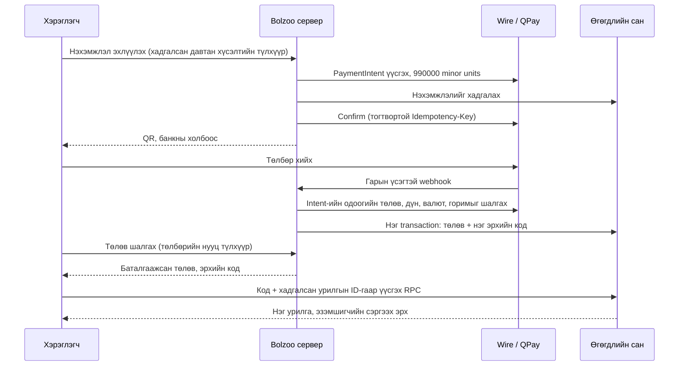

# Bolzoo төлбөрийн урсгал

2026-09-07-нд Wire-ийн албан ёсны заавар, төслийн Vercel/Node кодыг тулгаж засав.
Үндсэн үнэ **9,900₮**; нэг төлбөрөөр нэг урилга үүсгэх эрх олгоно.



## Баримталсан зарчим

- Үнийг сервер тогтооно. `PRICE_MNT=9900` бол Wire-ийн `amount=990000`.
  Browser-ийн дүнг хэрэглэхгүй. DB-ийн `amount` нь бүхэл төгрөг,
  `amount_minor` нь Wire рүү илгээх яг дүн.
- Нэг худалдан авалтын түлхүүрийг browser хүсэлтээс өмнө хадгална. Wire create
  болон confirm бүр өөр боловч дахин оролдох бүрд тогтвортой idempotency key-тэй.
  Wire-ийн 48 цагийн хадгалалтаас өмнө, 47 цагт хуучин тодорхойгүй хүсэлтийг хаана.
- Нэхэмжлэлийг төлж болох QR гаргахаас **өмнө** DB-д хадгална. Давтан checkout
  нь өмнөх төлөв, кодыг дарж бичихгүй.
- Redirect, query parameter, charge event-ийн нэрээр төлсөн гэж үзэхгүй.
  Сервер Wire GET API-аар intent ID, дүн, валют, live/test горимыг тулгана.
  `charge.failed` нь бүх нэхэмжлэл бүтэлгүйтсэн гэсэн үг биш.
- PostgreSQL row lock + transaction + unique payment/code холбоос нь нэг
  төлбөрт нэг код олгоно. Код олголт бүтэлгүйтвэл төлөвийн өөрчлөлт rollback болно.
  Хоцорсон webhook/poll нь `succeeded`-ийг буцаахгүй.
- Webhook raw body дээр HMAC-SHA256, 300 секундын хугацаа, тогтмол хугацааны
  харьцуулалт хийнэ. Event ID давхардлыг арилгана. Бүртгэлээс түрүүлсэн webhook
  болон provider/DB алдаанд дахин ирүүлэх non-2xx буцаана.
- Vercel Node helper хүсэлтийн stream-ийг урьдчилж уншдаг тул `vercel.json`-д
  `NODEJS_HELPERS=0` build/runtime тохируулсан. Next.js-ийн `bodyParser` тохиргоо
  энэ plain Node төсөлд хамгаалалт болж чадсангүй. Суусан Vercel runtime дээр
  ижил гарын үсэгтэй ping-ийг засварын өмнө 403, дараа нь 200 буцаахыг шалгасан.
- Шинэ төлбөрийн статус, код, цуцлалтад тусдаа browser secret шаардлагатай.
  DB зөвхөн hash-ийг хадгална. Нууц нь URL fragment-д байна; query эсвэл Referer-т
  орохгүй. API хариу `no-store`; provider/DB-ийн raw алдааг хэрэглэгчид задлахгүй.
- Browser polling давхцахгүй, хугацааны хязгаартай, алдааг ил харуулна.
  Нэхэмжлэлийг сервер цуцлагдсан гэж баталгаажуулсны дараа шинээр эхлүүлнэ.
  Банкны аппаас буцах, refresh, checkout хариу тасрахад өмнөх хүсэлтийг сэргээнэ.
- Урилга үүсгэх ID-г хүсэлтээс өмнө хадгална. Нэг код + нэг ID-г давтан илгээхэд
  өмнөх урилгаа авна; өөр урилгад код дахин хэрэглэхгүй. Хэрэглэгдсэн кодоор
  өмнө үүссэн урилгаа сэргээнэ. Сүлжээний алдаанд код, draft-ийг арилгахгүй.
- Mock нь зөвхөн `ALLOW_MOCK_PAYMENT=1`, production бус локал Node серверт,
  Wire key-гүй үед ажиллана. Vercel-ийн simulate endpoint үргэлж 403 буцаана.

## Production-д оруулах дараалал

1. Одоогийн DB backup авч, өмнөх migration-ууд хэрэгжсэн эсэхийг шалгана.
2. Шинэ API-г тавихаас өмнө дарааллаар хэрэгжүүлнэ:
   - `supabase/migrations/20260907090000_payment_integrity.sql`
   - `supabase/migrations/20260907090001_retry_safe_redemption.sql`
3. Vercel-д `SUPABASE_URL`, `SUPABASE_SERVICE_ROLE_KEY`, `WIRE_API_KEY`,
   `WIRE_WEBHOOK_SECRET`, `PUBLIC_BASE_URL=https://өөрийн-домэйн`, `PRICE_MNT=9900`
   тохируулна. `vercel.json` дахь `NODEJS_HELPERS=0`-ийг хадгална.
4. Эхлээд Wire-ийн `sk_test_...` key болон `sandbox` оператороор provider-тэй
   төгсгөл хүртэл шалгана. Wire-ийн нэг project-д `/api/wire-webhook` endpoint-ийг
   enabled/verified болгож, гарын үсгийн secret-ийг түүнд тааруулна.
5. Нэг төлбөрийг төлөх, refresh, давхар tab, банкнаас буцах, webhook redelivery,
   cancel, нэг кодоор нэг урилга үүсгэх, кодоор сэргээхийг staging дээр баталгаажуулна.
   Дараа нь live key болон идэвхтэй QPay operator/дансаар бодит бага дүнгийн
   хяналттай smoke test хийнэ. Байгаа pending төлбөрт шинэ үнэ хүчээр оноохгүй.

Энэ засвар **локал эх кодод** хийгдсэн. Production migration, deployment болон
Wire sandbox/live гүйлгээг энэ ажлын хүрээнд гүйцэтгээгүй. Provider-ийн бодит
эрх, оператор, домэйн/webhook тохиргооны шалгалт staging rollout дээр үлдэнэ.

Хуучин нэхэмжлэлийн `amount=9900` нь шинэ Wire заавраар 99₮ гэсэн утгатай
байж болзошгүй. Migration хуучин бүртгэлд `amount_minor=amount*100` тавина;
бага дүнгээр төлсөн хуучин pending invoice-д шинэ код автоматаар олгохгүй.
Эдгээрийг Wire dashboard-тай тулгаж гараар шийдвэрлэнэ. Өмнө олгосон кодыг
хураахгүй. Шилжилтээс өмнөх нэхэмжлэлүүдэд хуучин opaque intent ID-гаар
сэргээх нийцлийг хадгалсан; browser secret-ийн хамгаалалт шинэ checkout-д үйлчилнэ.
Локал JSON хадгалалт нь хөгжүүлэлтэд зориулсан нэг процессын горим; production
гүйлгээний бүрэн transaction баталгааг Supabase RPC хангана.

## Шалгалт

```bash
npm ci
npm test
# Локал, бодит мөнгөгүйгээр гараар шалгах:
ALLOW_MOCK_PAYMENT=1 node server.js
```

Тестүүд нь provider-ийг дуурайлгасан gateway, жинхэнэ HTTP локал сервер,
JSDOM дахь browser script, PGlite дахь PostgreSQL migration/RPC ашиглана.
Төлбөрийн бодит API key шаардахгүй, мөнгө шилжүүлэхгүй.

## Албан ёсны эх сурвалж

- [Wire — Money and time](https://docs.wire.mn/docs/concepts/money-and-time)
- [Wire — Idempotency](https://docs.wire.mn/docs/concepts/idempotency)
- [Wire — Create PaymentIntent](https://docs.wire.mn/docs/api/paymentintents/v1/payment_intents/post)
- [Wire — Confirm PaymentIntent](https://docs.wire.mn/docs/api/paymentintents/v1/payment_intents/id/confirm/post)
- [Wire — Object schemas / statuses](https://docs.wire.mn/docs/api/schemas)
- [Wire — Webhooks](https://docs.wire.mn/docs/guides/webhooks)
- [Vercel — Raw request body](https://vercel.com/kb/guide/how-do-i-get-the-raw-body-of-a-serverless-function)
